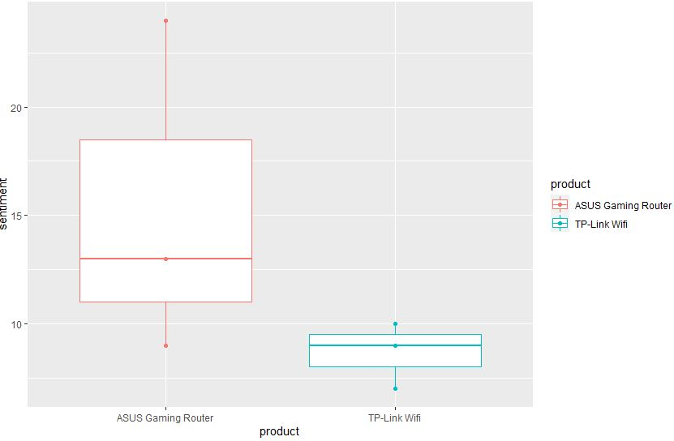

# Semantic-Analysis-of-Product-review-in-R
Semantic analysis of product review using R. Review of the product  will be separated into positve and negative word

### Library
```
library(dplyr) 
library(tidytext) 
library(tidyr) 
library(ggplot2)
```
### Box plot of product
<div style="text-align:center"></div>

### Dataset
Source: Randomly collect on internet
